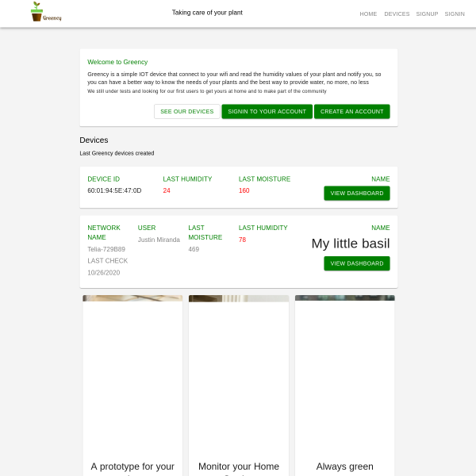
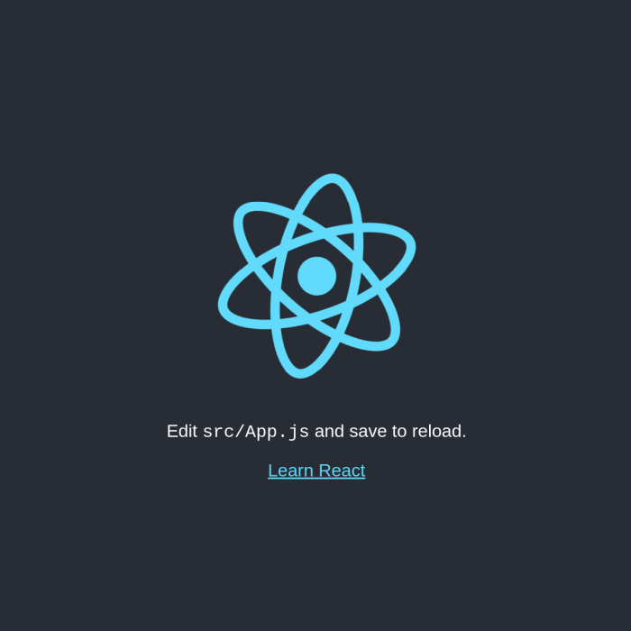
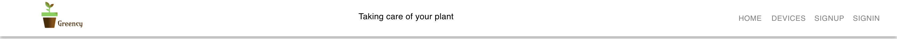

# Tutorial: Building a Responsive IoT Dashboard Web App with React and Material-UI Grid Component

Greency Id - React Dashboard UI for IoT Plant Monitor.

[Access the IoT Dashboard experience](https://greency.vercel.app/)




**React** is a very popular open source, front end [Javascript web framework and library](https://reactjs.org/) for creating user interfaces (UIs) and components. It is created and maintained by Facebook. React UI components are the building blocks of a React application. React is very suitable for building user interfaces for small and large applications by engineering teams.

**Material-UI** are React components that implement Google's Material Design. Material Design is a design system popularized by Google which encapsulates their design principles and guidelines. With Material-UI, we can bring Google's Material Design to our React app. Using Material-UI with React provides a set of consistent design and user experience. material-UI can help you make beautiful apps. A variety of Material UI designs can be found [here](https://material-ui.com/discover-more/showcase/).

The Grid Component

In this tutorial, we will create an Internet of Things (IoT) Dashboard UI. [Grid](https://material-ui.com/components/grid/) is very valuable for building dashboards, e-commerce sites, blogs, portfolios, to mention a few. The grid adapts to screen size and orientation. This component can be used to showcase images, products, and people.

If you'd like to see the source code on Github and demo of this project, you can view them here: [demo](https://greency.vercel.app/) | [source code](https://github.com/intellipeer/greency)


# Let's Get Started!

# Setting up your Greency App

## Requirements

- Install npm on your computer.
- Install the latest version of Node.js or higher on your computer.
- Open a text editor (IDE) such as Visual Studio Code to build our project.
- Basic understanding of HTML, CSS, Javascript, JSX, and the Terminal.

# Step 1 — Create React App

We will start by creating the initial React app. Open up the terminal in VS Code or otherwise and run the following commands.

```bash
npx create-react-app grid-app
cd grid-app
npm start
```

This would automatically open a web page. You can also type http://localhost:3000/ in your browser's URL bar.



We now have a starter React app which is a single web page. This is a verygood starting point where we can customize what's been generated to build apps according to our needs.

For more information on create-react-app, click this [link](https://github.com/facebook/create-react-app).

# Step 2 — Adding Material-UI to our React App

The next step is to install Material.UI which again takes a few lines of code.

```bash
npm install -s @material-ui/core
npm install -s @material-ui/icons
```

# Step 3 — Navigation Bar

Go to the src folder and add the app logo: greency.png. Logos can be obtained as asset from stock sites or generated using a site like [FreeLogoDesign](https://www.freelogodesign.org/)

Go to the src/components folder and create NavBar.jsx. 



Let's add our **Navigation Bar**. Basing our code from the [Material-UI's documentation](https://material-ui.com/components/app-bar/), we will be making a our app bar.

We will start by importing the necessary components from Material-UI. We will apply the style, add the logo, add text, and add the buttons.

```bash
import React from 'react';
import { makeStyles } from '@material-ui/core/styles';
import AppBar from '@material-ui/core/AppBar';
import Toolbar from '@material-ui/core/Toolbar';
import Typography from '@material-ui/core/Typography';
import Button from '@material-ui/core/Button';
import IconButton from '@material-ui/core/IconButton';
import MenuIcon from '@material-ui/icons/Menu';

const useStyles = makeStyles((theme) => ({
  root: {
    flexGrow: 1,
  },
  menuButton: {
    marginRight: theme.spacing(2),
  },
  title: {
    flexGrow: 1,
  },
  sub:{
      flexGrow:1
  },
  
}));

export default function ButtonAppBar() {
  const classes = useStyles();

  return (
    <div className={classes.root}>
      <AppBar position="static">
        <Toolbar style={{backgroundColor:'white',color:'black'}}>
          <IconButton edge="start" className={classes.menuButton} color="white" style={{color:'white'}} aria-label="menu">
            <MenuIcon />
          </IconButton>
          <Typography variant="h6" className={classes.title}>
            <a href="/"></img></a> 
          </Typography>
          <div className={classes.sub}>
          <Typography variant="subtitle1" gutterBottom>
          Taking care of your plant
            </Typography>
          </div>
          <div className={classes.sub2} style={{marginLeft:'10px'}}>
          <Button color="inherit" style={{color:'grey'}} href="/">Home</Button>
          <Button color="inherit" style={{color:'grey'}} href='/devices'>Devices</Button>
          <Button color="inherit" style={{color:'grey'}}>SIGNUP</Button>
          <Button color="inherit" style={{color:'grey'}}>signin</Button>
          
          </div>
          
        </Toolbar>
      </AppBar>
    </div>
  );
}
```
# Step 4 — Add Basic Hero Section

Go to the src/components/Home folder and create Hero.jsx.

```bash
import React from 'react';
import {Grid,Paper,Typography,Button} from '@material-ui/core'

export default function Hero(){
    return (
        <div >
            <Grid container >
                <Grid xs={12} sm={2} md={2} xl={2} lg={2} />
                <Grid item xs={12} sm={8} md={8} xl={8} lg={8}>
                    <Paper style={{backgroundColor:'white',padding:'20px'}}>
                        <div>
                        <Typography variant="subtitle1" gutterBottom style={{color:'green'}}>
                        Welcome to Greency
                        </Typography>
                        <Typography variant="body2" gutterBottom>
                        Greency is a simple IOT device that connect to your wifi and read the humidity values of your plant and notify you, so you can have a better way to know the needs of your plants and the best way to provide water, no more, no less
                         </Typography>
                         <Typography variant="caption" display="block" gutterBottom>
                         We still under tests and looking for our first users to get yours at home and to make part of the community
                        </Typography>
                        </div>
                        <br></br>
                        <div align="right" justify="right">
                        <Button style={{color:'green'}} variant="outlined" href="/devices">See our devices</Button>
                        <Button style={{marginLeft:'4px',color:'white',backgroundColor:'green'}} variant="contained">Signin to your account</Button>
                        <Button style={{marginLeft:'4px',color:'white',backgroundColor:'green'}} variant="contained">Create an account</Button>
                        </div>
                    </Paper>
                </Grid>
                <Grid xs={12} sm={2} md={2} xl={2} lg={2} />
            </Grid>
        </div>
    )
}
```

# Step 5 — Add Info Section

Go to the src/components/Home folder and create Info.jsx.

```bash
import React from 'react';

import {Grid,Typography} from '@material-ui/core'

export default function Info(){
    return (
        <div>
             <Grid container>
                 <Grid item xs={12} sm={2} md={2} xl={2} lg={2} />
                 <Grid item xs={12} sm={8} md={8} xl={8} lg={8}>
                 <Typography variant="h6" gutterBottom>
                    Devices
                </Typography>
                <Typography variant="subtitle2" gutterBottom>
                Last Greency devices created
                </Typography>
                 </Grid>
                 <Grid item xs={12} sm={2} md={2} xl={2} lg={2} />
             </Grid>
        </div>
    )
}
```

# Step 6 — Add Device Section

Go to the src/components/Home folder and create Device.jsx.

## Creating API call for Device

We are going to install Axios. To do that, run the following command in the root folder of the project:

```bash
npm i axios --save
```

Let's open the Device.jsx in your code editor. I have set a local state with data because we are going to get some device data from the API.

I'm going to use an API I created on the Heroku website (https://greency-id-api.herokuapp.com/api/v1/devices). To get the data, I’ll use the axios package installed earlier from NPM. Let’s add the code below to Device.jsx and create a call:

```bash
import React,{ useState,useEffect } from 'react';
import axios from 'axios';
import {Grid,Paper,Typography,Button} from '@material-ui/core'

export default function Device(){
const [data, setData] = useState([]);
useEffect(() => {

    const fetchData = async () => {
        const result = await axios.get('https://greency-id-api.herokuapp.com/api/v1/devices');
        setData({device:result.data[0].device,moisture:result.data[0].moisture,humidity:result.data[0].humidity});
    }

    fetchData();

}, []);
    
    
    
    return (
        <div>

            <Grid container>
                <Grid item xs={12} sm={2} md={2} lg={2} xl={2} />
                <Grid item xs={12} md={8} sm={8} lg={8} xl={8}>
                    <Paper style={{padding:'20px'}}>
                        <Grid container>
                            <Grid item xs={12} md={3} sm={3} lg={3} xl={3}>
                            <Typography variant="body1" gutterBottom style={{color:'green'}}>
                                    DEVICE ID
                             </Typography>
                             <Typography variant="body1" gutterBottom >
                             {data.device}
                             </Typography>
                            </Grid>
                            <Grid item xs={12} md={3} sm={3} lg={3} xl={3}>
                            <Typography variant="body1" gutterBottom style={{color:'green'}}>
                                LAST HUMIDITY
                             </Typography>
                             <Typography variant="body1" gutterBottom  style={{color:'red'}}>
                             {data.humidity}
                             </Typography>
                            </Grid>
                            <Grid item xs={12} md={3} sm={3} lg={3} xl={3}>
                            <Typography variant="body1" gutterBottom style={{color:'green'}}>
                                LAST MOISTURE
                             </Typography>
                             <Typography variant="body1" gutterBottom  style={{color:'red'}}>
                             {data.moisture}
                             </Typography>
                            </Grid>
                            <Grid item xs={12} md={3} sm={3} lg={3} xl={3} align="right">
                            <Typography variant="body1" gutterBottom style={{color:'green'}}>
                                    NAME
                             </Typography>
                             <Button style={{color:'white',backgroundColor:'green'}} variant="contained">VIEW DASHBOARD</Button>
                            </Grid>
                        </Grid>
                    </Paper>
                </Grid>
                <Grid item xs={12} sm={2} md={2} lg={2} xl={2} />
            </Grid>
        </div>
    )
}
```

In the code above, I fetched data from the API and saved in our state. Let's take a look at what is the format of our data before we display our posts:

```bash
[
   {
      "device":"60:01:94:5E:47:0D",
      "moisture":160,
      "humidity":24
   },
   {
      "device":"Telia-729B89",
      "moisture":469,
      "humidity":78
   }
]
```


# Step 7 — Add Network Section

Go to the src/components/Home folder and create Network.jsx.

Let's open the Network.jsx in your code editor. I have set a local state with data because we are going to get some network and device data from the API.

I'm going to use an API I created on the Heroku website (https://greency-id-api.herokuapp.com/api/v1/devices). To get the data, I’ll use the axios package installed earlier from NPM. Let’s add the code below to Network.jsx component and create a call:

```bash
import React,{useState,useEffect} from 'react';
import axios from 'axios';
import {Grid,Typography,Button,Paper} from '@material-ui/core'

export default function Network(){
    const [data, setData] = useState([]);
    useEffect(() => {

            const fetchData = async () => {
                const result = await axios.get('https://greency-id-api.herokuapp.com/api/v1/devices');
                setData({device:result.data[1].device,moisture:result.data[1].moisture,humidity:result.data[1].humidity});
            }

            fetchData();
        
        }, []);


      const timeElapsed = Date.now();
const today = new Date(timeElapsed);
    
    return (
        <div>
            <Grid container>
                <Grid item xs={12} sm={2} md={2} xl={2} lg={2} />
                <Grid item xs={12} sm={8} md={8} xl={8} lg={8}>
                    <Paper style={{padding:'20px'}}>
                    <Grid container>
                            <Grid item xs={12} md={2} sm={2} lg={2} xl={2}>
                            <Typography variant="body1" gutterBottom style={{color:'green'}}>
                            NETWORK NAME
                             </Typography>
                             <Typography variant="body1" gutterBottom style={{color:'grey'}} >
                             {data.device}
                             </Typography>
                             <Typography variant="body1" gutterBottom style={{color:'grey'}} >
                             LAST CHECK
                             </Typography>
                             <Typography variant="body1" gutterBottom style={{color:'grey'}} >
                             {today.toLocaleDateString()}
                             </Typography>
                            </Grid>
                            <Grid item xs={12} md={2} sm={2} lg={2} xl={2}>
                            <Typography variant="body1" gutterBottom style={{color:'green'}}>
                            USER
                             </Typography>
                             <Typography variant="body1" gutterBottom  style={{color:'grey'}}>
                             Justin Miranda
                             </Typography>
                            </Grid>
                            <Grid item xs={12} md={2} sm={2} lg={2} xl={2}>
                            <Typography variant="body1" gutterBottom style={{color:'green'}}>
                            LAST MOISTURE
                             </Typography>
                             <Typography variant="body1" gutterBottom  style={{color:'grey'}}>
                             {data.moisture}
                             </Typography>
                            </Grid>
                            <Grid item xs={12} md={2} sm={2} lg={2} xl={2}>
                            <Typography variant="body1" gutterBottom style={{color:'green'}}>
                            LAST HUMIDITY
                             </Typography>
                             <Typography variant="body1" gutterBottom  style={{color:'red'}}>
                             {data.humidity}
                             </Typography>
                            </Grid>
                            <Grid item xs={12} md={4} sm={4} lg={4} xl={4} align="right">
                            <Typography variant="body1" gutterBottom style={{color:'green'}}>
                                    NAME
                             </Typography>
                             <Typography variant="h4" gutterBottom>
                             My little basil
                            </Typography>
                             <Button style={{color:'white',backgroundColor:'green'}} variant="contained">VIEW DASHBOARD</Button>
                            </Grid>
                        </Grid>
                    </Paper>
                </Grid>
                <Grid item xs={12} sm={2} md={2} xl={2} lg={2} />
            </Grid>
        </div>
    )
}
```

# Step 8 — Card 

Go to the src/components/Home folder and create Card.jsx.

```bash
import React from 'react';
import { makeStyles } from '@material-ui/core/styles';
import Card from '@material-ui/core/Card';
import CardActionArea from '@material-ui/core/CardActionArea';

import CardContent from '@material-ui/core/CardContent';
import CardMedia from '@material-ui/core/CardMedia';
import Typography from '@material-ui/core/Typography';

const useStyles = makeStyles({
  root: {
    maxWidth: 345,
  },
  media: {
    height: 400,
  },
});

export default function Cards(props) {
  const classes = useStyles();

  return (
    <Card className={classes.root}>
      <CardActionArea>
        <CardMedia
          className={classes.media}
          image={props.image}
          title="Contemplative Reptile"
        />
        <CardContent>
          <Typography gutterBottom variant="h5" component="h2">
            {props.title}
          </Typography>
          <Typography variant="body2" color="textSecondary" component="p">
            {props.desc}
          </Typography>
        </CardContent>
      </CardActionArea>
    </Card>
  );
}

```

# Step 9 — Add the Card Section with Grid Layout

Go to the src/components/Home folder and create CardSection.jsx.

```bash
import React from 'react';
import {Grid} from '@material-ui/core'
import Card from './Card'
export default function CardSection(){
    return (
        <div>
            
            <Grid container justify="center" align="center">
               <Grid item xs={12} sm={2} md={2} xl={2} lg={2} />
               <Grid item  container xs={12} sm={8} md={8} xl={8} lg={8}  spacing={2}>
               <Grid item xs={12} sm={4} md={4} lg={4} xl={4}>
                    <Card title="A prototype for your plant"  desc="Lorem ipsum dolor, sit amet consectetur adipisicing elit. Deleniti fuga eaque dolorum magnam quasi qui " image={require('./home.jpg')} />
                </Grid>
                <Grid item xs={12} sm={4} md={4} lg={4} xl={4}>
                    <Card title="Monitor your Home Garden" desc="Lorem ipsum dolor, sit amet consectetur adipisicing elit. Deleniti fuga eaque dolorum magnam quasi qui" image={require('./monitor.jpg')} />
                </Grid>
                <Grid item xs={12} sm={4} md={4} lg={4} xl={4}>
                    <Card title="Always green" desc="Lorem ipsum dolor, sit amet consectetur adipisicing elit. Deleniti fuga eaque dolorum magnam quasi qui" image={require('./green.jpg')} />
                </Grid>
               </Grid>
               <Grid item xs={12} sm={2} md={2} xl={2} lg={2} />
            </Grid>
        </div>
    )
}
```


# Step 10 — Creating the Home page using Home.jsx

Now, we can import the necessary components to create the home page by creating Home.jsx in the src/views folder.

```bash
import React from 'react';
import Hero from '../components/Home/Hero'
import Info from '../components/Home/Info'
import Device from '../components/Home/Device'
import Network from '../components/Home/Network'
import CardSection from '../components/Home/CardSection'
export default function Home(){
    return (
        <div>
           
            <br></br>
            <br></br>
            <br></br>
            <Hero />
            <br></br>
            <Info />
            <br></br>
            <Device />
            <br></br>
            <Network />
            <br></br>
            <CardSection />
        </div>
    )
}
```

# Step 11 — Creating the Devices page using Device.jsx

Now, we can import the necessary components to create the home page by creating Home.jsx in the src/views folder.

```bash
import React from 'react';

import Device from '../components/Home/Device'
import Network from '../components/Home/Network'
export default function Device2(){
    return (
        <div>
            <br></br>
            <br></br>
            <br></br>
            <Device />
            <br></br>
            <br></br>
            <Network />
        </div>
    )
}
```

# Step 12 — App.js and Deploying it

We are going to install React Router. To do that, run the following command in the root folder of the project:

```bash
npm i react-router-dom --save
```

We have our content pages represented by the Home and Device views in the src/views folder. What we need to do is tie all of these together to create our app. This is where React Router comes in. 

Now, we can import all of our components in App.js and export out the final app. To start using it, go to App.js, and ensure your import statements look as follows:

```bash
import React from 'react';
import './App.css';
import NavBar from './components/NavBar'
import {
  BrowserRouter as Router,
  Switch,
  Route,
 
} from "react-router-dom";

import Home from './views/Home'
import Device from './views/Device'
function App() {
  return (
    <div style={{backgroundColor:'#f4f4f4'}}>
       <NavBar/>
      <Router>
      <Switch>
          <Route path="/devices">
            <Device />
          </Route>
          <Route path="/" exact>
            <Home />
          </Route>
        </Switch>
      </Router>
    </div>
  );
}

export default App;
```

We are importing Route, Switch, and BrowserRouter from the react-router-dom NPM package we installed earlier. In addition, we are importing our Home and Device views or components since we will be referencing them as part of loading our content.

The way React Router works is by defining what I call a routing region. Inside this region, you will have two things:
- Your navigation links
- The container to load your content into


# Conclusion

In this tutorial, we used Material-UI Grid component and React to create different sections of on the page.

We used a create-react-app to setup a skeletal React.js application easily and Material-UI for styling. We fetched data from the REST API.

After creating a new repository in Github, I pushed the React code from my local machine to this new repo. I deployed and hosted the site on Vercel. If you prefer a different platform to deploy your React and Material-UI web app, you can check out the [official react documentation on deployment](https://create-react-app.dev/docs/deployment) for your web application.


To see the demo, [click here](https://greency.vercel.app/). 


Thanks for reading!
