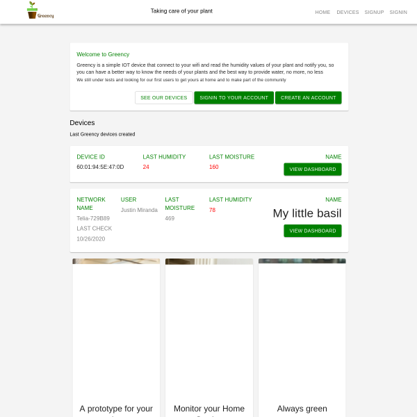
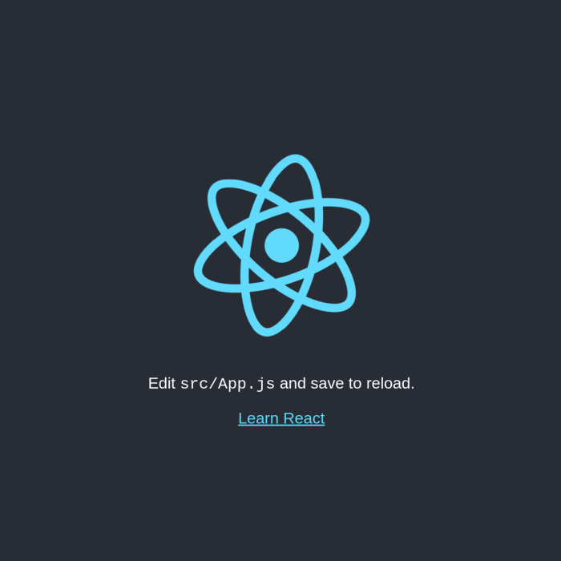

# Tutorial: Building a Responsive IoT Dashboard Web App with React and Material-UI Grid Component

Greency Id - React Dashboard UI for IoT Plant Monitor.

[Access the IoT Dashboard experience](https://greency.vercel.app/)




**React** is a very popular open source, front end [Javascript web framework and library](https://reactjs.org/) for creating user interfaces (UIs) and components. It is created and maintained by Facebook. React UI components are the building blocks of a React application. React is very suitable for building user interfaces for small and large applications by engineering teams.

**Material-UI** are React components that implement Google's Material Design. Material Design is a design system popularized by Google which encapsulates their design principles and guidelines. With Material-UI, we can bring Google's Material Design to our React app. Using Material-UI with React provides a set of consistent design and user experience. material-UI can help you make beautiful apps. A variety of Material UI designs can be found [here](https://material-ui.com/discover-more/showcase/).

The Grid Component

In this tutorial, we will create an Internet of Things (IoT) Dashboard UI. [Grid](https://material-ui.com/components/grid/) is very valuable for building dashboards, e-commerce sites, blogs, portfolios, to mention a few. The grid adapts to screen size and orientation. This component can be used to showcase images, products, and people.

If you'd like to see the source code on Github and demo of this project, you can view them here: [demo](https://greency.vercel.app/) | [source code](https://github.com/intellipeer/greency)


# Let's Get Started!

# Setting up your Greency App

## Requirements

- Install npm on your computer.
- Install the latest version of Node.js or higher on your computer.
- Open a text editor (IDE) such as Visual Studio Code to build our project.
- Basic understanding of HTML, CSS, Javascript, JSX, and the Terminal.

# Step 1 — Create React App

We will start by creating the initial React app. Open up the terminal in VS Code or otherwise and run the following commands.

```bash
npx create-react-app grid-app
cd grid-app
npm start
```

This would automatically open a web page. You can also type http://localhost:3000/ in your browser's URL bar.



# Installation

Clone this repository on your local machine:


This project was bootstrapped with [Create React App](https://github.com/facebook/create-react-app).

## Available Scripts

In the project directory, you can run:

### `yarn start`

Runs the app in the development mode.<br />
Open [http://localhost:3000](http://localhost:3000) to view it in the browser.

The page will reload if you make edits.<br />
You will also see any lint errors in the console.

### `yarn test`

Launches the test runner in the interactive watch mode.<br />
See the section about [running tests](https://facebook.github.io/create-react-app/docs/running-tests) for more information.

### `yarn build`

Builds the app for production to the `build` folder.<br />
It correctly bundles React in production mode and optimizes the build for the best performance.

The build is minified and the filenames include the hashes.<br />
Your app is ready to be deployed!

See the section about [deployment](https://facebook.github.io/create-react-app/docs/deployment) for more information.

### `yarn eject`

**Note: this is a one-way operation. Once you `eject`, you can’t go back!**

If you aren’t satisfied with the build tool and configuration choices, you can `eject` at any time. This command will remove the single build dependency from your project.

Instead, it will copy all the configuration files and the transitive dependencies (webpack, Babel, ESLint, etc) right into your project so you have full control over them. All of the commands except `eject` will still work, but they will point to the copied scripts so you can tweak them. At this point you’re on your own.

You don’t have to ever use `eject`. The curated feature set is suitable for small and middle deployments, and you shouldn’t feel obligated to use this feature. However we understand that this tool wouldn’t be useful if you couldn’t customize it when you are ready for it.

## Learn More

You can learn more in the [Create React App documentation](https://facebook.github.io/create-react-app/docs/getting-started).

To learn React, check out the [React documentation](https://reactjs.org/).

### Code Splitting

This section has moved here: https://facebook.github.io/create-react-app/docs/code-splitting

### Analyzing the Bundle Size

This section has moved here: https://facebook.github.io/create-react-app/docs/analyzing-the-bundle-size

### Making a Progressive Web App

This section has moved here: https://facebook.github.io/create-react-app/docs/making-a-progressive-web-app

### Advanced Configuration

This section has moved here: https://facebook.github.io/create-react-app/docs/advanced-configuration

### Deployment

This section has moved here: https://facebook.github.io/create-react-app/docs/deployment

### `yarn build` fails to minify

This section has moved here: https://facebook.github.io/create-react-app/docs/troubleshooting#npm-run-build-fails-to-minify
